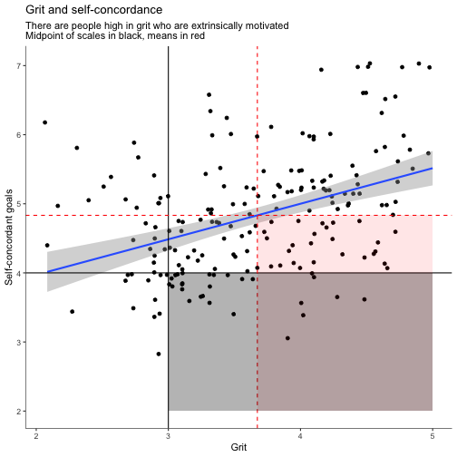

Grit and Self Concordance
========================================================
author: Benjamin Lira Luttges
date: Jan 11, 2021
autosize: true

Background
========================================================

Grit is often seen as equivalent to 

Preliminary Data
========================================================

Preliminary Data
========================================================


```
processing file: Slides.Rpres
── Attaching packages ─────────────────────────────────────── tidyverse 1.3.0 ──
✓ ggplot2 3.3.2     ✓ purrr   0.3.4
✓ tibble  3.0.4     ✓ dplyr   1.0.2
✓ tidyr   1.1.2     ✓ stringr 1.4.0
✓ readr   1.4.0     ✓ forcats 0.5.0
── Conflicts ────────────────────────────────────────── tidyverse_conflicts() ──
x dplyr::filter() masks stats::filter()
x dplyr::lag()    masks stats::lag()

── Column specification ────────────────────────────────────────────────────────
cols(
  .default = col_double()
)
ℹ Use `spec()` for the full column specifications.

`geom_smooth()` using formula 'y ~ x'
Quitting from lines 38-56 (Slides.Rpres) 
Error: '~/Dropbox (Character Lab)/Grit Rubric Project/Data/cleaned_grit rubric.csv' does not exist.
In addition: Warning messages:
1: Missing column names filled in: 'X1' [1] 
2: Removed 1 rows containing non-finite values (stat_smooth). 
3: Removed 1 rows containing missing values (geom_point). 
Execution halted
```
